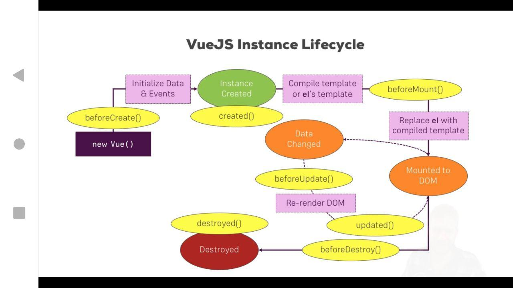
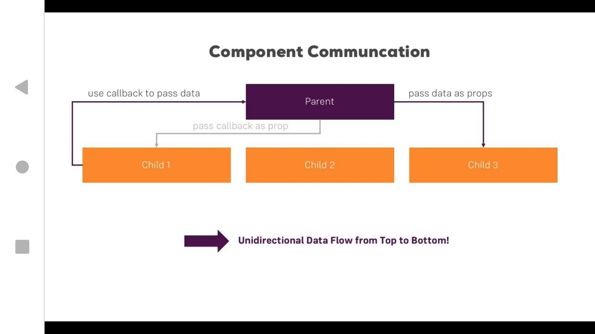
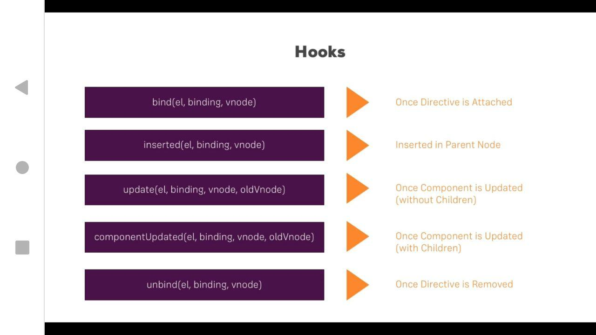
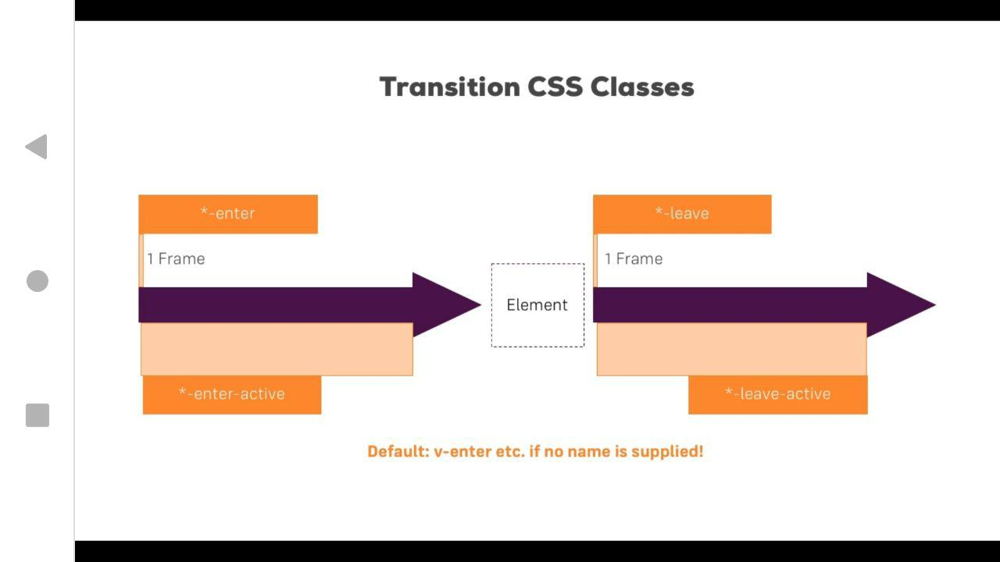
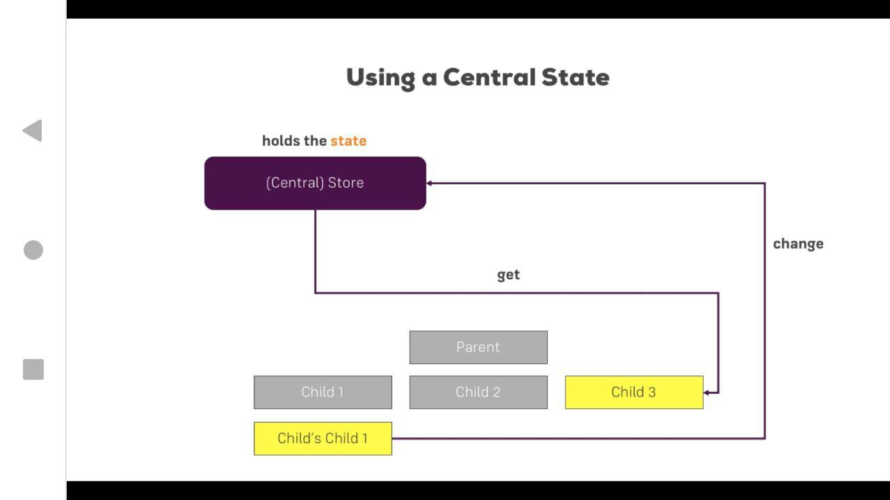
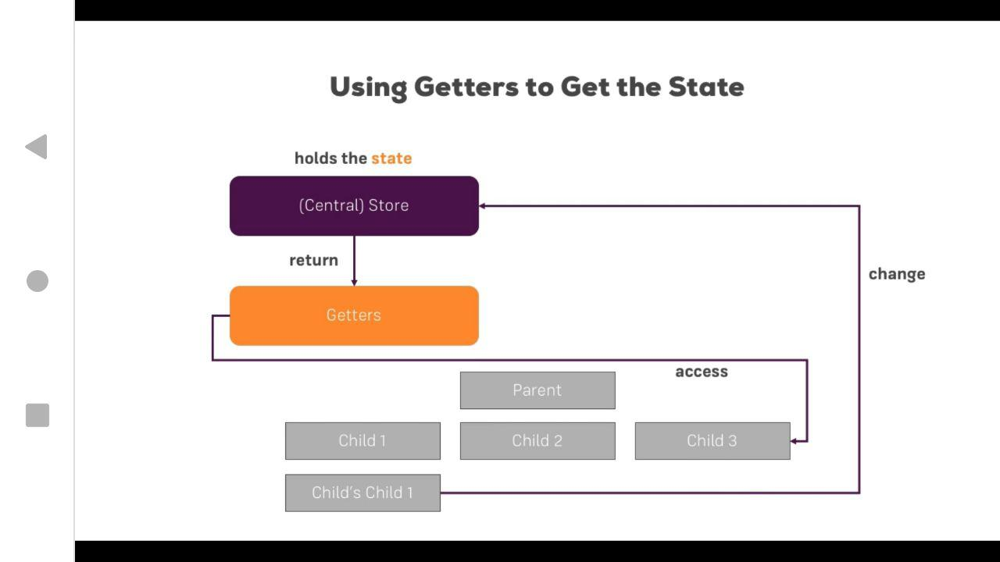

### Exercises
* Folder contains exercises, demos and examples after every lecture block.

### Lecture Blocks
* Folder Contains information from lectures with comments and additional examples.

* Lecture-block-8 Contains only one project which all examples from all lecture-block course.

### Projects
* Folder Contains pet projects which was too big to place it into exercise folder.

### Useful information
* Vue Instance Lifecycle

### Unidirectional Data Flow in VueJS 2
* Unidirectional Data Flow in VueJS 2

### Directive Hooks

* bind - how could directive be bound to element.
* insert - how to insert to parent node
* update - how to update existing node in a dom. Will be updated without children
* componentUpdate - how to update existing node in a dom WITH all children inside.
* unbind - how to unbind element from DOM.

### Transition & Animation
* 
> *-enter means v-enter like default naming and *yourTransitionObjectName*-enter.
> The same for all other states.

* Transition Event Javascript Hooks.
> They work with animation on the different steps of its lifecycle.

### VUEX:

* Direct accessing and fetching data from the store

* Getters with the vuex store.

> To get more info take a look on Lecture-block-11 Readme file and project.