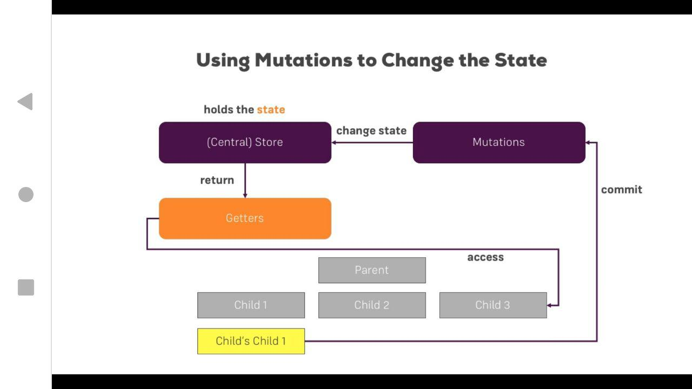
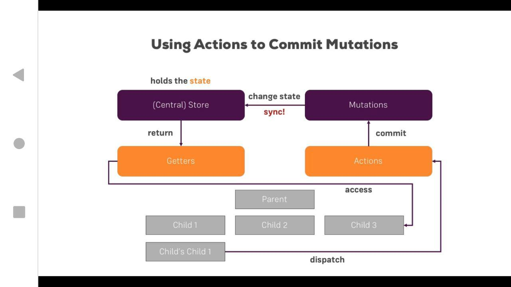

### Final project:
[Stock Trader Project](https://glareone.github.io/VueJS-2-Portfolio/)

### Exercises
* Folder contains exercises, demos and examples after every lecture block.

### Lecture Blocks
* Folder Contains information from lectures with comments and additional examples.

* Lecture-block-8 Contains only one project which all examples from all lecture-block course.

### Projects
* Folder Contains pet projects which was too big to place it into exercise folder.

### Useful information
* Vue Instance Lifecycle

### Unidirectional Data Flow in VueJS 2
* Unidirectional Data Flow in VueJS 2

### Directive Hooks

* bind - how could directive be bound to element.
* insert - how to insert to parent node
* update - how to update existing node in a dom. Will be updated without children
* componentUpdate - how to update existing node in a dom WITH all children inside.
* unbind - how to unbind element from DOM.

> To get more info take a look on Lecture-block-11 Readme file and project.

### Transition & Animation
* 
> *-enter means v-enter like default naming and *yourTransitionObjectName*-enter.
> The same for all other states.

* Transition Event Javascript Hooks.
> They work with animation on the different steps of its lifecycle.

### VUEX:

* Direct accessing and fetching data from the store

* Getters with the vuex store.

* Mutations with the vuex store.

* Async changes with Actions + Mutations:

> Namespaces in VUEX:
> You could use auto-namespaces for Vuex >= 2.1
> https://forum.vuejs.org/t/vuex-automatic-namespacing-for-beginners-how-to/24592

### Auth:
 
 * Auth scheme with token for SPA
 

### Vue CLI 3

* Vue CLI-3:

> to install vue-cli 3 you need to uninstall vue-cli 2 first: npm uninstall -g vue-cli
> then: npm install -g @vue/cli

1. "vue create" (for CLI 3) - instead of vue init (CLI 2)

* if you want to continue using "vue init" - you need to install it to cli3:
> npm install @vue/cli-init

2. this application still uses webpack, but under the hood, vue-service uses it. But you will not find webpack config files
 anymore. You can't access directly to webpack. But you can add some plugins to it. Take a look on official doc.

3. Vue CLI UI (Graphical Project Manager):

4. could be used from console by:
> vue ui

5. Options:

 
* Vue-cli-service and instant Prototyping.
1. by default it is installed locally. but you could also install it globally:
> npm install -g @vue/vue-cli-service

https://cli.vuejs.org/guide/prototyping.html - prototyping.
 
 
2. Plugins:
https://ru.vuejs.org/v2/guide/plugins.html - Plugin docs.
 
>to add plugin via vue/cli:
>$ vue add vuetify

https://vuetifyjs.com/en/getting-started/quick-start

* Environment variables:

1. .env | .env.development | .env.production files are automatically used by cli. 
All what you need - is create it.

env uses in all modes.

PAY ATTENTION!
2. This properties must stat from VUE_APP_:
VUE_APP_YOURPROPERTY, VUE_APP_YOUR_SELECTED_URL and so on;
it doesn't work without VUE_APP at the beginning.

https://stackoverflow.com/questions/50828904/using-environment-variables-with-vue-js

* Build targets:

1. could be used from console: 
>vue build Hello.vue --target app

