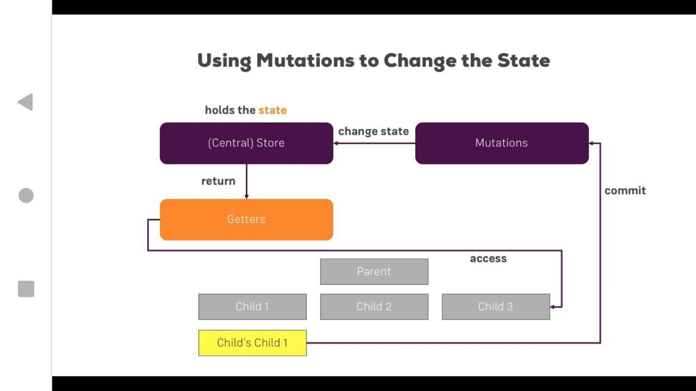
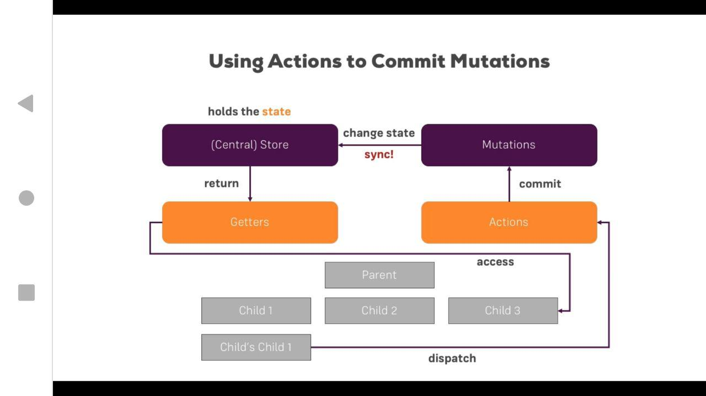

### Lecture block 16, vuex

* Direct accessing and fetching data from the store


* Getters with the vuex store.


* Mutations with the vuex store.


* Async changes with Actions + Mutations:



``` bash
# install dependencies
npm install

# serve with hot reload at localhost:8080
npm run dev

# build for production with minification
npm run build
```

